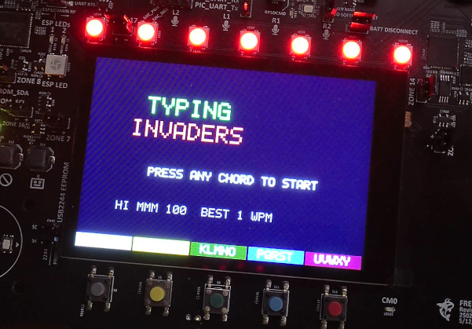

# Chordboard Invaders

An arcade typing game for the [FreeWili 2](https://www.freewili.com) that teaches
you its two-press chord keyboard — Typing of the Dead meets Space Invaders.
Colored ASCII aliens fall from the sky carrying words; type them on the
chordboard to blast them before they reach your defense line.



**▶ Watch it in action:** <https://youtu.be/OEr_qWnGxTY>

## The chordboard

The FreeWili 2 types with 5 colored buttons (**Gray, Yellow, Green, Blue,
Red**). Every letter is a *two-press chord*: the first press picks a group of
five letters (`abcde | fghij | klmno | pqrst | uvwxy`), the second picks the
letter within that group. So `e` = Gray→Red, `m` = Green→Green.

The bar at the bottom of the screen mirrors the physical buttons live: it
shows the letter groups normally, and after your first press it switches to
the five single letters of the group you chose. The game is built to move you
from reading that bar to chording by muscle memory.

## How to play

- **Start**: at the title screen, type any letter (a full two-press chord).
- **Shoot**: type the next letter of any alien's word. Your first matching
  letter locks the targeting bracket onto that alien; keep typing its word to
  destroy it. Wrong letters just buzz — they are never entered, so there's no
  backspace, but they break your streak and drop your target lock.
- **Don't let them land**: any alien crossing the defense line costs a life.
  You have 3. The LEDs pulse red when something is getting close.
- **Chord hints**: in early waves every letter shows two colored dots — its
  chord, in keycap colors. From wave 4 only the *next* letter shows dots;
  from wave 7 you're on your own. Fumble the same letter twice and its dots
  come back (mercy rule).
- **Streaks & score**: score = 10 × word length × species bonus × streak
  multiplier. The multiplier grows with every flawless word (no misses) up to
  ×8, and resets to ×1 on any wrong press or lost life. Zap pitch rises with
  your streak so you can hear your multiplier.
- **Waves**: single letters first, then 3–4 letter words, then longer words,
  faster falls, and more aliens at once. Every 5th wave is a **boss** — a big
  red monster with a whole phrase and a health bar, typed word by word.
- **Species**: green **Drifters** (slow, common), cyan **Zigzags** (sway
  side to side), magenta **Divers** (rare, fast, short word — type it NOW),
  orange **Shielded** tanks (two words to kill), and the boss.
- **Smart bomb**: shake the device hard — screen flash, haptic thump, LED
  burst, every alien on screen dies. Worth zero points, once per wave. A
  panic button, not a strategy.
- **WPM**: the HUD shows your live words-per-minute over the last 15 seconds.
  Game over shows your run average and accuracy, the top-10 table stores WPM
  with each score, and your all-time best WPM lives on the title ticker.
- **High scores**: crack the top 10 and you'll enter 3 initials — on the
  chordboard, naturally (it switches to uppercase; tap the top half of the
  screen to backspace). Scores survive power-off.

## Building

Prerequisites:

- ARM GNU toolchain (`arm-none-eabi-gcc`), CMake ≥ 3.21, Ninja, Python 3
- [Pico SDK](https://github.com/raspberrypi/pico-sdk) 2.x — set
  `PICO_SDK_PATH`, or let the build fetch it from git automatically
- For host unit tests on Windows: MinGW GCC (MSYS2 works)

```sh
git clone --recurse-submodules https://github.com/freewili/chordboard-invaders.git
cd chordboard-invaders
python tools/fw.py build     # firmware -> build/apps/typing_invaders/typing_invaders.elf (+ .uf2)
python tools/fw.py test      # host unit tests, no hardware needed
```

> Do **not** pass `-DPICO_BOARD` on any cmake command line — the board is
> selected in the top-level `CMakeLists.txt` (RP2350B, 48 GPIO) and a
> command-line override silently breaks the configuration.

## Flashing

With a CMSIS-DAP debug probe attached (FreeWili 2 debug interface 0):

```sh
python tools/fw.py flash     # program + verify + reset via OpenOCD
python tools/fw.py rtt       # stream SEGGER RTT diagnostics
```

If `flash` reports a verify checksum mismatch, run it again — first-attempt
verify on a freshly-running target can fail spuriously; a verified-OK pass is
the one to trust. Alternatively, drop the `.uf2` from
`build/apps/typing_invaders/` onto the board's BOOTSEL drive.

## Project layout

```
apps/typing_invaders/   the game
  game.c/.h             rules: waves, targeting, scoring, WPM (pure, host-tested)
  words.c  aliens.c     word lists & species tables (pure)
  hints.c               letter -> two-color chord lookup (pure)
  sfx.c                 chiptune synth: squares, noise, jingles (pure)
  hiscore.c             top-10 codec with CRC (pure)
  shake.c  fb.c         shake detector, software framebuffer (pure)
  render.c              playfield, HUD, chord bar, all screens
  main.c                boot, 30 Hz loop, screen state machine
  sfx_ring.c ledfx.c haptic.c hiscore_flash.c   hardware bindings
tests/                  standalone host CTest tree (no Pico SDK, no hardware)
wilibsp/                FreeWili 2 board support package (git submodule)
tools/fw.py             build / flash / rtt / test runner
docs/superpowers/       design spec and implementation plan
```

Every gameplay rule lives in hardware-free modules covered by the host test
suite (`python tools/fw.py test` — 11 suites). The hardware layer is a thin
consumer of game events.

## License

[MIT](LICENSE) © 2026 Dave Robins
